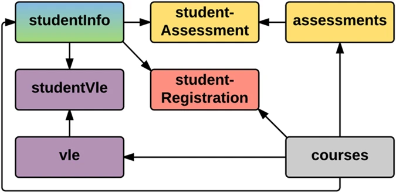

## Objective
The goal of this project is to replicate the experiment of (Lee & Kizilcec, 2020) but with another dataset which is open (and containing different attributes). Therefore, the goal is not to compare the results but to apply the same method.

## Dataset
The [Open University Learning Analytics dataset](https://analyse.kmi.open.ac.uk/open_dataset#description) (Kuzilek et al., 2017) was chosen as it contains demographic information on students, required to have equivalent protected groups as in (Lee & Kizilcec, 2020).

The Open University (OU) is the United Kingdom's largest public academic institution by number of students and a world pioneer in distance learning. The majority of the OU's undergraduate students are based in the UK and principally study off-campus. In 2017, around 170,000 students were registered in different programs. Teaching materials and other content are delivered to students via the Virtual Learning Environment (VLE). Students’ interactions with the educational materials are recorded and stored in university data warehouse.

This anonymised Open University Learning Analytics Dataset (OULAD) contains data about courses, students and their interactions with the VLE for 7 selected courses (called modules). Presentations of courses start in February and October - they are marked by “B” and “J” respectively - in the years 2013 and 2014. The dataset consists of tables connected using unique identifiers. All tables are stored in the csv format.




## Quick start
Run the associated notebook `1_notebook.ipynb`.

To quickly explore each data table, run:
```
list_files()
```
Output:
```
assessments.csv
courses.csv
studentAssessment.csv
studentInfo.csv
studentRegistration.csv
studentVle.csv
vle.csv

Total: 7
```
Then, select any table you want to display:
```
read_data('studentInfo.csv')
```

## References
Lee, H., & Kizilcec, R. F. (2020). Evaluation of Fairness Trade-offs in Predicting Student Success. 1–3. http://arxiv.org/abs/2007.00088

Kuzilek J., Hlosta M., Zdrahal Z. [Open University Learning Analytics dataset](https://www.nature.com/articles/sdata2017171) Sci. Data 4:170171 doi: 10.1038/sdata.2017.171 (2017).
