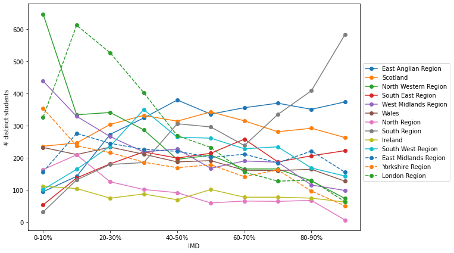
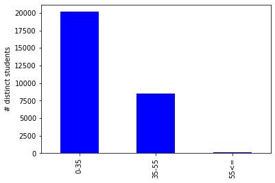
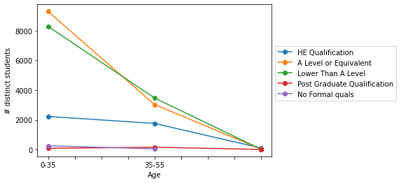

## Basic statistics
Based on `'studentInfo.csv'` data table, the OULAD:
- has records of 28,785 distinct students (`how_many_students()`).
- has 'M' or 'F' gender types (`how_many_genders()`).
- indicates whether a student has declared a disability: 'Y'/'N'.
- classifies students according to their age class: '0-35', '35-55', '55<='.
- gives their highest student education level on entry to the module presentation: 'HE Qualification', 'A Level or Equivalent', 'Lower Than A Level', 'Post Graduate Qualification', 'No Formal quals'.
- classifies students according their location in 13 different UK areas: 'East Anglian Region', 'Scotland', 'North Western Region', 'South East Region', 'West Midlands Region', 'Wales', 'North Region', 'South Region', 'Ireland', 'South West Region', 'East Midlands Region', 'Yorkshire Region', 'London Region'.
- gives the [Indices of Multiple Deprivation (IMD)](https://www.warrington.gov.uk/sites/default/files/2019-09/english-indices-of-deprivation-2015-research-report.pdf), which is a UK measure of poverty, of the place where the student lived during the module-presentation: '0-10%', '10-20', '20-30%', '30-40%', 40-50%', '50-60%', '60-70%', '70-80%', '80-90%', '90-100%'.
- contains records for 7 courses, called modules (`how_many_modules()`) named 'AAA', 'BBB', 'CCC', 'DDD', 'EEE', 'FFF', 'GGG'.
- the courses have 4 different starting dates (`how_many_presentations()`) named '2013J', '2014J', '2013B', '2014B'.
- gives the number of how many times the student has attempted a module.
- gives the total number of credits for the modules the student is currently studying.
- gives the student’s final result in the module-presentation: 'Pass', 'Withdrawn', 'Fail', 'Distinction'.

There is no missing values except in the 'imd_band' column (1,111 instances, that correspond to 971 distinct students without IMD records).

Based on that, we have demographic information (gender, age, disability), academic information (highest education, number of previous attempts, number of credits, final results), geographic information (region), economic information (IMD).

## Data table analysis

In this part, we answer to the following questions :
* how many students are men/women?
* how many students are disabled? how many of them are men/women?
* from which regions students come from?
* are the regions linked to students' IMD?
* how old are the students?
* are their highest education linked to their age?

Among the 28,785 distinct students, 52.27% are men and 47.73% are women (`ratio_gender()`). 9.44% of the students declared to have a disability (`ratio_disability()`), 46.45% of them are men, 53.55% women (`disability_per_gender()`).

They belong to different regions of UK following this table (`ratio_region()`):

|region               |  # distinct students  |  percentage (%) |
|-------------------- | --------------------- | ----------------|
|East Anglian Region  |                  3000 |            10.42|
|Scotland             |                  2934 |            10.19|
|London Region        |                  2845 |             9.88|
|South Region         |                  2737 |             9.51|
|North Western Region |                  2548 |             8.85|
|West Midlands Region |                  2269 |             7.88|
|South West Region    |                  2154 |             7.48|
|East Midlands Region |                  2095 |             7.28|
|Wales                |                  1876 |             6.52|
|South East Region    |                  1875 |             6.51|
|Yorkshire Region     |                  1792 |             6.23|
|North Region         |                  1588 |             5.52|
|Ireland              |                  1072 |             3.72|

Among these individual regions, the OULAD shows different IMDs as an IMD is evaluated at a smaller scale, the Lower-layer Super Output Area levels, which are homogenous small areas of relatively even size containing approximately 1,500 people (see [part 2.4](https://www.warrington.gov.uk/sites/default/files/2019-09/english-indices-of-deprivation-2015-research-report.pdf)). The dataset covers all the IMD intervals (`ratio_imd()`). From the graph below (`imd_per_region()`), most of the regions seem to have relatively equally distributed population among IMDs, except 'North Western Region' and 'London Region' that appear to have higher proportion of low IMDs and the contrary for 'South Region' and 'East Anglian Region'. It could be roughly said that northwest and urban regions are wealthier, unlike southeast and rural regions.

The majority of students are between 0 and 35 years old (69.98%), followed by the 35-55 years old (29.40%) and the 55+ years old (0.62%) (`ratio_age()`).

Most of the students represented in the dataset are A-level students (high school diploma) or lower. A quarter is in higher education and very few students are in Master level or have no qualification (`ratio_education()`).

|highest_education          |    # distinct students   | percentage (%)|
|--------------------------- | ---------------------  |----------------|
|A Level or Equivalent                 |       12355          |   42.92|
|Lower Than A Level        |                   11780       |      40.92|
|HE Qualification                    |          4092      |       14.22|
|No Formal quals                |                306      |        1.06|
|Post Graduate Qualification               |     252        |      0.88|

Finally, we display the distribution of the highest education among the age intervals (`ed_per_age()`).

