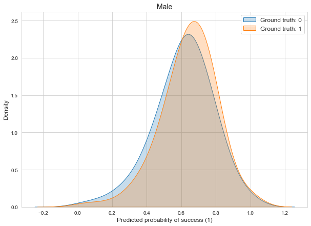
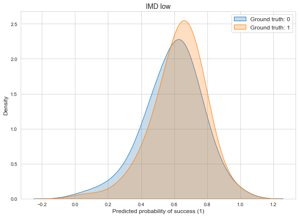
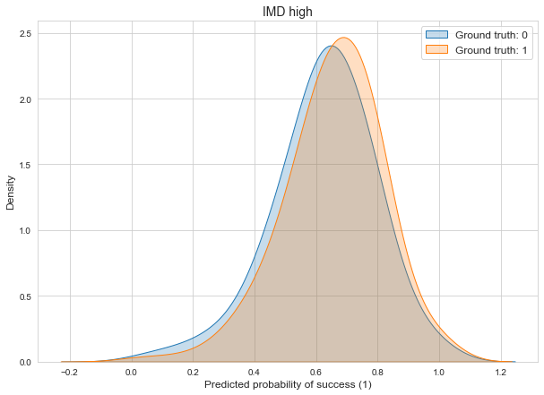

Now, we have our `X_train`, `X_test`, `y_train` and `y_test` sets. Before using them for the prediction model, we need to keep aside the indices of rows associated to students belonging to the protected attributes and to remove these protected attributes from the previous sets as they should not contribute to the prediction.

## Prediction model

As in (Lee & Kizilcec, 2020), we take an out-of-the-box random forest model to make prediction. They used default settings with the randomForest function in R while we use default settings with the RandomForestClassifier class in sklearn library.

## Results

The average results of the studied metrics for the trained model are the following:

| Accuracy | Recall | Precision | Demographic parity |
|-----|----------|----------|----------|
| 0.624 | 0.832 | 0.664 | 0.800 |

At the protected groupds levels, we have:

|Metrics | Male | Female | +/- | IMD low | IMD high | +/- |
|-----|----------|-|---------|----------|---------|-|
|Accuracy  1 | 0.611 | 0.638 | +0.027 | 0.605 | 0.647 | +0.042 |
|Recall (equality of opportunity)  2| 0.838 | 0.827 | -0.011 | 0.811 | 0.854 | +0.043 |
|Precision (positive predictive parity)  2| 0.643 | 0.686 | +0.043 | 0.633 | 0.696 | +0.063 |
|Demographic parity (proportion)  2| 0.807 | 0.792 | -0.015 | 0.769 | 0.836 | +0.067 |

 1  Performance metric\
 2  Fairness metric

  

  

  

  
To be coherent with what (Lee & Kizilcec, 2020) measured, we take this formula instead of (TP + FP) mentioned [here](https://rdrr.io/cran/fairness/man/dem_parity.html) or [here](https://cran.r-project.org/web/packages/fairness/vignettes/fairness.html) (tutorial on fairness R package).

Globally, and especially for the demographic parity, we want to have the same results among each group.

## Plots

